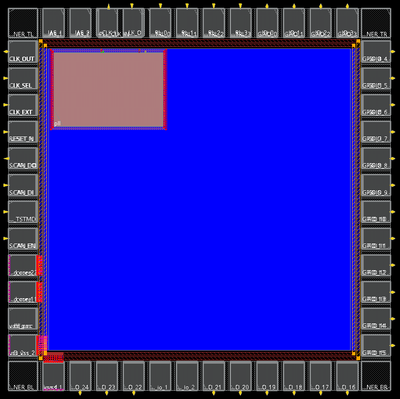
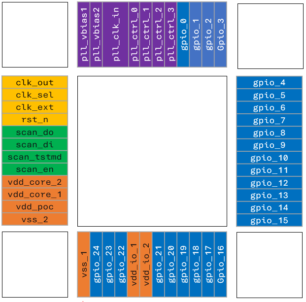

# ELEC70142 Digital VLSI Design Project

Version 1.1 4 December 2025

This repository provides source files and step-by-step guidelines for synthesis and place-and-route flows for the ELEC70142 Digital VLSI Design project.  
All projects must use the supplied floorplan to ensure compatibility with packaging.  
The floorplan specifies the padring, power planning, and required clocking resources.

#### Directory Structure

- `synth/`: Genus synthesis flow folder
    - `genus_synth.tcl`: Synthesis script
    - `genus_dft.tcl`: Scan chain insertion script
- `layout/`: Innovus place-and-route flow folder
    - `innovus_pnr.tcl`: PnR flow script
    - `DATA/`:
        - `TOP.v`: Top-level module with padring and PLL
        - `floorplan/`: Floorplan files for Innovus
- `PLL/`: PLL GDSII and LEF files
- `docs/`: Supplementary documentation

#### Floorplan

The provided floorplan implements a padring with 44 IOs, including 25 freely usable GPIOs. Additional information about the padring can be found in the [`docs/Padframe.md`](./docs/Padframe) file.  
The floorplan already includes an instance of the PLL module and implements the initial power planning. Power stripes are not included and should be added after placing the SRAM or other macro blocks.

<div align="center">
    
    
</div>

#### Clock Source Selection

- Two clock sources are available: an external clock via pad and a PLL-generated clock. The external signal `clk_sel` selects between them using a MUX instantiated in the TOP module. The cell used is the 2-to-1 clock multiplexer `CKMUX2D1BWP7T`. This is not glitch-safe, but dynamic switching is not required for this application.
- Only static clock source selection is supported. Dynamic switching may introduce clock glitches. Ensure the desired clock source is selected before powering up the IC.


## Genus Flow
- Use the `genus_synth.tcl` script to synthesize your design. Ensure you specify the top module name, source files, and clock constraints.
- After synthesis, use the `genus_dft.tcl` script to insert scan chains into your design.

## Innovus Flow
Follow these guidelines during the Place and Route flow:

### Required Files
- `TOP.v`: The top-level module for the IC. It instantiates the IO cells, pads, PLL module, and clock selection logic, and manages their connections.
- Floorplan files: Specify IO pad placement, power planning, and PLL macro placement.
- PLL design files: the LEF defines the PLL module geometry and pin locations. The GDS file is needed for generating the final GDS output.

### TOP File Configuration
- Instantiate your design and connect it to the IO pads:
    - Ensure clock, reset, and scan chain pins are properly connected.
    - Connect the GPIO pins.
- Configure the GPIO pads as inputs or outputs and enable pull-up resistors if needed:
    - Use the predefined `gpio_dir` assignments to set each GPIO as input (hardcoded 1) or output (hardcoded 0).
> The `TOP.v` file is a structural Verilog file. Only wires, standard cells, and synthesized modules should be defined. Do not include any behavioral Verilog constructs.


### PnR Flow Setup

- Use the `PnR.tcl` template for the Innovus flow. Adjust script parameters as needed and include the relevant SRAM libraries.
- Add the SRAM libraries to the MMMC (Multi-Mode Multi-Corner) script.
- In the SDC file generated during synthesis:
    - Change the design name to `TOP` by adding: `current_design TOP`
    - Replace the `create_clock` line with the following, setting the correct period and waveform values:
      ```
      create_clock -name "clk" -period 3.0 -waveform {0.0 1.5} [get_pins CLK_EXT/C]
      create_clock -name "pll_clk" -period 3.0 -waveform {0.0 1.5} [get_pins pll/f_out]
      ```
- Modify and extend the script as required by the design.

---
### Deliverables
---

All deliverables must be via your Team's project repo.   The name of the repo has your team number and your project name (e.g. **Team 1 - ARIA**), and is private to your team, but accessible by myself (pykc) and your academic supervisor.  All deliverables **must be** in the repo by *__mid-night Sunday 4 January 2026__* when all coursework team repos must be frozen.  

Deliverables must include the following:
1. A `README.md` file in the root directory that briefly describe what your team has achieved. This is a **joint statement** for the team. 
2. Each individual's **personal statement** explaining what you contributed, reflection about what you have learned in this project, mistakes you have made, special design decisons, and what you might do differently if you were to do it again or have more time.  This statement must be succinct and to the point, yet must include sufficient details for me to check against the commit history of the repo so that any claims can be verified. Including links to a selection of specific commits which demonstrate your work would be most helpful. If you work with another member of your group on a module, make sure to give them [co-author credit](https://docs.github.com/en/pull-requests/committing-changes-to-your-project/creating-and-editing-commits/creating-a-commit-with-multiple-authors#creating-co-authored-commits-on-the-command-line). Additionally, try to make meaningful commit messages.
3. A folder called `rtl` with the source of your processor. If you have multiple versions due to the stretched goals, you may use multiple branches. Your `README.md` file must provide sufficient explanation for me to understand what you have done and how to find your work on all branches you wish to be assessed.  The `rtl` folder should also include a `README.md` file listing who wrote which module/file.
4. A folder called 'veification' which includes everything required to verify your team's design by running ONLY scripts.  You should also include evidence of your chip working as intended.  This should also include test vector files to be submitted with the design for post-fabrication check by TSMC or IMED.
5. A detailed test plan - assuming that your team's design is fabricated adn returned in late May or early June, how will this chip be tested either by your team or by another team.
6. A folder called 'tapeout' which includes the final GDSII file needed to be sent to IMEC/Europractice for tapeout. This GDSII file must be extracted from Virtuoso **after** the design has passed DRC and LVS checks with Calibre. 


You must also provide a Makefile or a shell script that allows me and my teaching team to build your chip  and run the testbench to repeat what you have done.
<br>
___

## Assessment Criteria
___

Assessment for this coursework, which accounts for 40% of the entire two-terms module, is divided into two components with equal weighting:
1. Team achievement- This component of the marks is common to all team members and is dependent on the overall achievement of the team.
2. Individual achievement - This component of the marks is awarded to individual student based on declaration by the team of the individual contribution, with verification based on evidence (e.g. based on the git commit and push profile of an individual), individual account of his/her contributions and reflections, and the actual deliverables by the individual.

<br>