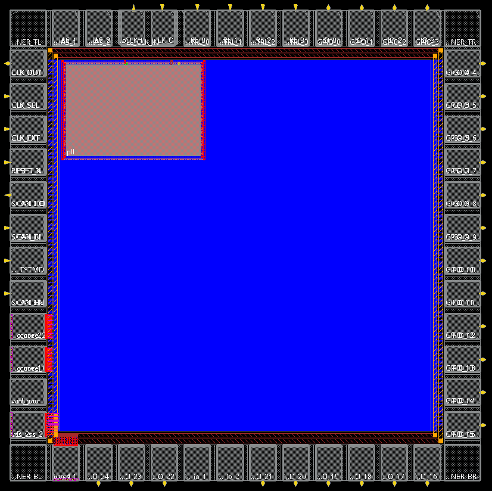
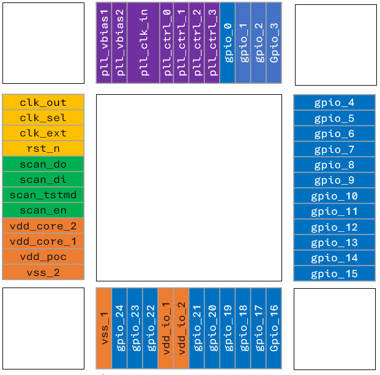

# ELEC70142 Digital VLSI Design Project

Version 2.0 10 September 2026

This repository provides source files and step-by-step guidelines for synthesis and place-and-route flows for the ELEC70142 Digital VLSI Design project, using Synopsys Fusion Compiler.  
All projects must use the supplied floorplan to ensure compatibility with packaging.  
The floorplan specifies the padring, power planning, and required clocking resources.

#### Directory Structure

- `Makefile`: every step of the flow. `make help` lists them
- `design.tcl`: the settings for your design, and the only file you need to edit
- `rtl/`: the source files of your design
- `constraints/`: timing constraints. `TOP.sdc` for the chip; add one for your design
- `scripts/`: the flow scripts
- `layout/DATA/`:
    - `TOP.v`: Top-level module with padring and PLL
    - `floorplan/`: the floorplan the padring is built from
- `PLL/`: PLL GDSII, LEF and SPICE files
- `docs/`: Supplementary documentation

Load the tools and the PDK once per shell before running anything, as in the labs:
```bash
vlsi-tooling/syn tsmc65LP
```

#### Floorplan

The provided floorplan implements a padring with 44 IOs, including 25 freely usable GPIOs. Additional information about the padring can be found in the [`docs/Padframe.md`](./docs/Padframe.md) file.  
The floorplan already includes an instance of the PLL module and implements the power planning. The flow builds the padring, the power rings and the power mesh from it; do not modify them.

<div align="center">
    
    
</div>

#### Clock Source Selection

- Two clock sources are available: an external clock via pad and a PLL-generated clock. The external signal `clk_sel` selects between them using a MUX instantiated in the TOP module. The cell used is the 2-to-1 clock multiplexer `CKMUX2D1BWP7T`. This is not glitch-safe, but dynamic switching is not required for this application.
- Only static clock source selection is supported. Dynamic switching may introduce clock glitches. Ensure the desired clock source is selected before powering up the IC.


## From RTL to tapeout

Every step is a `make` target, run from the project directory with the tools loaded. `make help` lists them. Each step writes its reports to `reports/`, its outputs to `outputs/` and its log to `logs/`.

### 1. Describe your design

Files to edit:
- `rtl/`: your source files.
- `constraints/<your_top>.sdc`: the clock and IO constraints of your design, as in Lab 1.
- `design.tcl`: the name of your top module, the list of source files and the constraints file. If your design uses SRAM macros, list them with the directory the memory compiler wrote and give each a position inside the core. If scan should shift on a clock other than `clk`, or your reset port is not `rst_n`, say so here too.

The memory compiler's outputs are TSMC material under the NDA and are never committed: `.gitignore` excludes them. They live in your project directory but not in your repository, so every clone that runs the flow, a teammate's or a CI runner's, needs them put back, from the compiler or from a copy on the server.

### 2. Synthesize, insert scan, generate patterns, check equivalence

```bash
make synth
make dft
make atpg
make lec
```

- `make synth` synthesizes your design on its own into a gate-level netlist, `outputs/<your_top>_synth.v`. Check the timing and area reports before going further: a design that does not meet its period here will not meet it in the chip.
- `make dft` inserts the scan chain into that netlist and creates the ports `scan_en`, `scan_testmode`, `scan_di` and `scan_do` on your design. It writes `outputs/<your_top>_dft.v`, the netlist the chip is built from, and the test protocol.
- `make atpg` generates the stuck-at test patterns for the chain and reports the fault coverage. The patterns, `outputs/<your_top>_patterns.stil`, and the fault report are deliverables.
- `make lec` proves with Formality that the scan-inserted netlist is equivalent to your RTL. It catches what simulating the RTL cannot, such as a signal with two drivers that synthesis resolved silently.

### 3. Build the chip around it

Files to edit:
- `layout/DATA/TOP.v`: instantiate your design and connect `clk`, `rst_n`, the four scan ports and your GPIOs to the pads. Set each GPIO pad's direction and pull-up with the `gpio_dir` and `gpio_pullen` assignments, input hardcoded 1 and output hardcoded 0. `TOP.v` is structural: wires, standard cells and your synthesized module only, no behavioural Verilog.
- `constraints/TOP.sdc`: set the clock period to your design's.

```bash
make sram          # only with memories, once
make floorplan     # only with memories, to check their placement
make fusion
make lec_chip
```

- `make sram` builds the reference libraries of the memories listed in `design.tcl` from the views the memory compiler wrote. Once, and again if a memory changes.
- `make floorplan` builds the die, the padring, the macros and the power plan without placing any logic, and checks that every macro sits inside the core, clear of the PLL and of each other. Use it to settle macro positions before the full run.
- `make fusion` runs the whole flow: the floorplan, placement of your netlist inside it, clock tree, routing, chip finish and export. The results are in `outputs/`: `TOP.gds`, the layout netlist `TOP_layout.v`, `TOP_lvs.v` for LVS, and the SDF and SPEF for gate-level simulation. `reports/finish_qor.rpt` has the final timing.
- `make lec_chip` proves that the layout netlist is equivalent to `TOP.v` with your scan-inserted netlist inside it, so nothing in place and route changed the logic or the scan chain.

The padring, the PLL and the power plan come from the supplied floorplan and must not be modified.

### 4. Sign off

The layout must pass DRC (Design Rule Check) to be accepted for tapeout by the foundry. While a clean LVS (Layout Versus Schematic) is not required by the foundry, it is mandatory for your design to be eligible for fabrication.  
Refer to the [`Signoff guide`](./docs/drc_lvs_guide.md) for instructions on performing DRC and LVS checks with Calibre from Custom Compiler on `outputs/TOP.gds`.

Once these checks are complete, export the final GDSII file for tapeout from Custom Compiler.

### Continuous integration

Optional, and worth it: `docs/ci/` holds two GitHub Actions workflow templates, one for checks on every push and one for a nightly run of the whole flow on the teaching server. [`docs/ci_cd.md`](./docs/ci_cd.md) explains how to set them up and why.


---
### Deliverables
---

All deliverables must be via your Team's project repo.   The name of the repo has your team number and your project name (e.g. **Team 1 - ARIA**), and is private to your team, but accessible by myself (pykc) and your academic supervisor.  All deliverables **must be** in the repo by *__mid-night Sunday 4 January 2026__* when all coursework team repos must be frozen.  

Deliverables must include the following:
1. A `README.md` file in the root directory that briefly describe what your team has achieved. This is a **joint statement** for the team. 
2. Each individual's **personal statement** explaining what you contributed, reflection about what you have learned in this project, mistakes you have made, special design decisons, and what you might do differently if you were to do it again or have more time.  This statement must be succinct and to the point, yet must include sufficient details for me to check against the commit history of the repo so that any claims can be verified. Including links to a selection of specific commits which demonstrate your work would be most helpful. If you work with another member of your group on a module, make sure to give them [co-author credit](https://docs.github.com/en/pull-requests/committing-changes-to-your-project/creating-and-editing-commits/creating-a-commit-with-multiple-authors#creating-co-authored-commits-on-the-command-line). Additionally, try to make meaningful commit messages.
3. A folder called `rtl` with the source of your processor. If you have multiple versions due to the stretched goals, you may use multiple branches. Your `README.md` file must provide sufficient explanation for me to understand what you have done and how to find your work on all branches you wish to be assessed.  The `rtl` folder should also include a `README.md` file listing who wrote which module/file.
4. A folder called 'verification' which includes everything required to verify your team's design by running ONLY scripts.  You should also include evidence of your chip working as intended.
5. A concise user manual that describes the chip’s functionality, usage instructions, pin configuration and descriptions, timing information, and any other details necessary for users to operate the chip effectively.
5. A detailed test plan - assuming that your team's design is fabricated and returned in late May or early June, how will this chip be tested either by your team or by another team.
6. A folder called 'tapeout' which includes:
    - the final GDSII file needed to be sent to IMEC/Europractice for tapeout. This GDSII file must be exported from Custom Compiler **after** the design has passed DRC and LVS checks with Calibre. 
    - Log files demonstrating successful DRC and LVS runs. Accepted errors are mentioned in the signoff guidelines.
    - The test patterns and the fault report written by `make atpg`: `outputs/<your_top>_patterns.stil` and `outputs/<your_top>_faults.rpt`.


You must also provide a Makefile or a shell script that allows me and my teaching team to build your chip  and run the testbench to repeat what you have done.
<br>
___

## Assessment Criteria
___

Assessment for this coursework, which accounts for 40% of the entire two-terms module, is divided into two components with equal weighting:
1. Team achievement- This component of the marks is common to all team members and is dependent on the overall achievement of the team.
2. Individual achievement - This component of the marks is awarded to individual student based on declaration by the team of the individual contribution, with verification based on evidence (e.g. based on the git commit and push profile of an individual), individual account of his/her contributions and reflections, and the actual deliverables by the individual.

<br>
