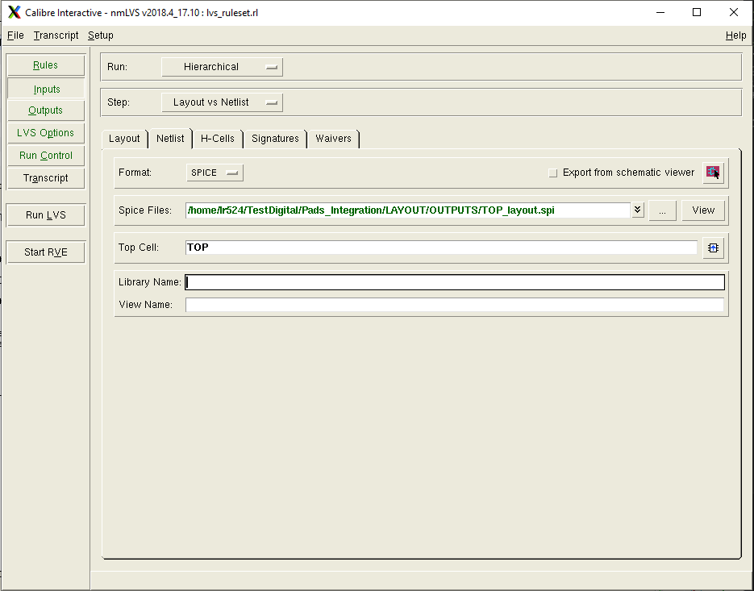

# Signoff process

## Importing the Design into Virtuoso

Start Virtuoso and create a new library. Go to **File > Import > Stream**.

Fill in the required fields as shown in the lab instructions, and use the following layer map file:
```
/usr/local/cadence/kits/tsmc/beLibs/65nm/TSMCHOME/digital/Back_End/lef/tcbn65lpbwp7t_141a/techfiles/Virtuoso/map/mapfiles/Vir65nm_9M_6X1Z1U_v1.4b.042508.map
```
In the **More Options** panel, select **Use All Libraries as Ref Lib**. *Do not* select **Replace [] with <>**, since bus names in the Verilog design use `[]` and must match during the LVS step.

You can now open and inspect the layout view of your design.

## Label Placement

To ensure LVS passes, you must label the power nets in your layout.

To create a pin in Virtuoso, select **Create > Pin** and enter the net name. Set the signal type appropriately. The pin will be created on the layer currently selected in the Layers pane—choose a layer with pin purpose (e.g., `M7 pin`).

After placing the pin, add a label with the same name on top of it using **Create > Label** or the shortcut `L`.

Add pins and labels for the following nets:
- VDD
- VSS
- VDDPST
- POC

Make visible only the `drw` and `pin` layers for M3, M5, and M7. Place VDD and VSS pins on the power ring (metal layer M5), VDDPST inside the padring on metal 7 tracks, and POC which you can find on a metal 3 wire on the inside of the padring.

Refer to the image for net locations.


<div align="center">
    
</div>


<!-- ## Generate Dummy Metal Layers
To meet the minimum metal density required by design rules, you can use Calibre to automatically generate dummy metal layers based on your design's GDS file. These dummy layers are then merged into your layout.

First, copy the dummy metal script to your working directory:
```
cp "/usr/local/cadence/kits/tsmc/65n_LP/Calibre/util/Dummy_Metal_Calibre_65nm_v25a/Dummy_Metal_Calibre_65nm.25a" ./
```

Next, edit the script to specify the path to your design's GDS file and the top cell name:
```
LAYOUT PATH "<path>/<to>/<your>/<topcell>TOP.gds"
LAYOUT PRIMARY "<TOP>"
```

Run the following command to execute the script:
```
calibre -drc Dummy_Metal_Calibre_65nm.25a
```

This will generate a new GDS file named `DM_gds`. Import this file into a new Cadence library. The top cell name should match your original design (e.g., `TOP`).

To include the dummy metal layers in your design, press `I` to instantiate a cell and select the appropriate library containing the dummy metal imported from GDS. Place the instance in your layout, then press `q` to open its properties and set the X and Y origin coordinates to `0`. This will align the dummy metal instance with your main design.   -->

## DRC

Run the Design Rule Check (DRC) using Calibre nmDRC, following the steps outlined in Lab 2. Your design must be free of critical DRC errors to be eligible for fabrication.

Certain DRC errors can be waived, including:
- ESD.*
- ESDIMP.*
- LUP.*
- DRM.R.1

Density-related errors (OP.DN, OD.DN, or Mx.DN) must be resolved, but these can be addressed later or by Europractice.

Additional errors that may be waived are listed in the technology release notes, available at:  
[/usr/local/cadence/kits/tsmc/beLibs/65nm/TSMCHOME/digital/Documentation/release_note/](usr/local/cadence/kits/tsmc/beLibs/65nm/TSMCHOME/digital/Documentation/release_note/)

Common DRC errors that require fixing include wires placed too close to metal plates, or single vias used where multiple vias are required for upper metal layers. To resolve these, adjust wire placement, modify metal geometries, or add more/larger vias as needed. 

## Extract the design SPICE model
The LVS process compares the SPICE netlist extracted from the layout with a reference netlist. For digital designs, there is typically no schematic, so the reference SPICE netlist is generated from the Verilog source using the Calibre tool `v2lvs`.

You can use the script provided below to automate this process, either within Innovus at theend of the PnR flow or by running it directly in the PDK environment. Specify the input Verilog file and the desired output SPICE file path. Update the script to include the correct path to your PLL SPICE file, and add any SRAM SPICE models you are using with the `-s` option.

Before running the conversion, comment out in the TOP verilog file the lines that instantiate the bond pads: `PAD60LU_SL BPAD_*`.

```
v2lvs -l /usr/local/cadence/kits/tsmc/beLibs/65nm/TSMCHOME/digital/Front_End/verilog/tcbn65lpbwp7t_141a/tcbn65lpbwp7t.v \
      -l /usr/local/cadence/kits/tsmc/beLibs/65nm/TSMCHOME/digital/Front_End/verilog/tphn65lpnv2od3_sl_200a/tphn65lpnv2od3_sl.v \
      -s /usr/local/cadence/kits/tsmc/beLibs/65nm/TSMCHOME/digital/Back_End/spice/tcbn65lpbwp7t_141a/tcbn65lpbwp7t_141a.spi \
      -s /usr/local/cadence/kits/tsmc/beLibs/65nm/TSMCHOME/digital/Back_End/spice/tphn65lpnv2od3_sl_200b/tphn65lpnv2od3_sl_3.spi \
      -s <pll_path>/PLL/PLL_25M_400M.sp \
      -s <path>/<of>/<the>/<memory>/<spice>/<file>.spi
      -v <path>/<of>/<the>/<input>/<file>.v \
      -o <path>/<of>/<the>/<output>/<file>.spi
```


## LVS

To perform the LVS check, open your design layout and select **Calibre > Run nmLVS**.

In the LVS ruleset field, enter:
```
/usr/local/cadence/kits/tsmc/65n_LP/Calibre/lvs/calibre.lvs
```

Click **Inputs** in the left menu. In the **Layout** tab, check "Export from layout viewer" and verify that the Top Cell name is correct.

Switch to the **Netlist** tab, set the format to **SPICE**, and provide the path to the SPICE file generated with `v2lvs`. Ensure the Top Cell name matches your design.

<div align="center">
    
</div>

Review any warnings reported by the tool, but ensure there are no errors. The most common errors are due to missing connections. If errors are found, correct the layout in Virtuoso and rerun LVS.

Finally, you should get a clean LVS: 
```
                         #       ###################       _   _   
                        #        #                 #       *   *   
                   #   #         #     CORRECT     #         |     
                    # #          #                 #       \___/  
                     #           ###################               
```

From Virtuoso main window select **File > Export > Stream** and export the GDSII file that is now ready for tapeout. 